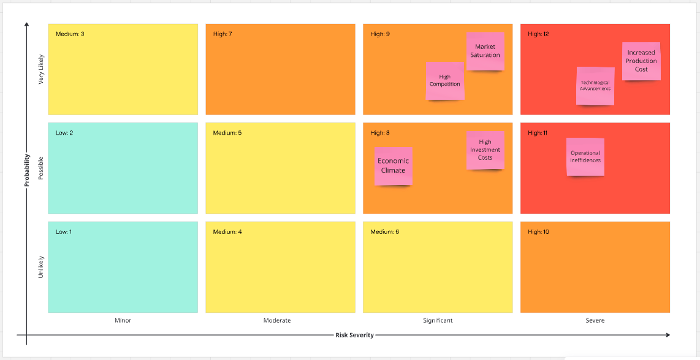

## Risk Analysis

This risk analysis highlights the various risks to the business upon implementing the change. The highest risk being the heavily saturated market which is unavoidable within the industry but allows us to look for other methods of standing out. The research and development to profitability ratio poses as a risk to consider, however, if the profits increased based on improvements, it should be a bearable risk to take on.